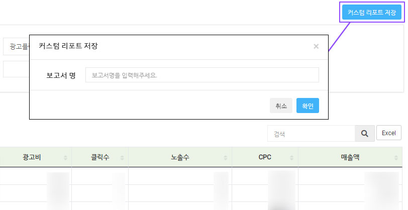

# CTS

## 1. 메뉴 구성&#x20;

| 메뉴             | 설명                                    |
| -------------- | ------------------------------------- |
| 통합 대시보드        | 전체/개별 광고주 성과를 시각화된 그래프로 확인            |
| 대시보드           | 광고주의 매체별 정보와 광고 성과 모니터링               |
| 실시간 모니터링       | 스크립트를 설치한 사이트의 실시간 데이터 모니터링           |
| 기여분석           | 스크립트를 설치한 사이트의 고객 행동 데이터 분석           |
| 커스텀 리포트        | 나에게 맞는 보고서 형식 생성하여 성과 지표를 다양한 기준으로 분석 |
| 광고 매체사/플랫폼/상품  | 매체/플랫폼/상품별 분석 종합 및 추세 확인              |
| 캠페인/광고그룹       | 캠페인/광고그룹 분석 종합 및 추세 확인                |
| 키워드(SA)        | 키워드 검색광고 분석 종합 및 추세 확인                |
| 소재(DA)         | 소재 광고 분석 종합 및 추세 확인                   |
| 보고서 다운로드       | 별도의 취합/가공작업 없이 광고성과 다운로드              |
| 대량관리           | 네이버 검색광고의 등록/수정/삭제를 대량으로 관리           |
| 모니터링 알람        | 발송될 광고 유형별 알람 설정 및 내역 확인              |

## 2. 통합 대시보드&#x20;


전체/개별 광고주 성과를 시각화된 그래프로 확인 및 제공합니다.


<figure><figcaption>
통합 대시보드 화면
</figcaption></figure>

#### 1. 기간 선택&#x20;

* 필터 : 조회 기간을 설정해주세요.

#### 2. 기간별 추이&#x20;

> 선택한 항목의 각 지표를 선택하여 최대 10개 상위 데이터의 기간별 추이를 확인할 수 있습니다.

<figure><figcaption>
기간별 추이 화면
</figcaption></figure>

통합 광고 성과의 광고주/매체의 기간별 추세를 확인할 수 있습니다. 일별/주별/월별 과 같은 기간 선택이 가능하며, 성과 추세를 희망하는 광고지표도 선택할 수 있습니다.

#### 3. 광고 매체사별 성과&#x20;

> 광고 성과 데이터가 수집된 모든 광고 매체사별 성과를 표로 제공합니다. 각 광고매체사별 성과를 비교 분석할 수 있습니다.

<figure><figcaption>
광고 매체사별 성과
</figcaption></figure>

* **광고매체사 :** 각 광고매체사를 표기합니다.&#x20;
* **라이브 중인 계정 수 :** 각 광고 매체사의 현재 실행중인 계정 개수를 표기합니다.&#x20;
* **광고상품 :** +버튼을 통하여 각 라이브 계정 상세 상품목록의 데이터를 확인할 수 있습니다.&#x20;
* **노출수/클릭수/CTR/CPC/전환수/총 광고비 :** 해당 상품에 대한 상세 데이터를 표기합니다.&#x20;

#### 4. 항목별 지표 비중&#x20;

> 각 항목의 지표 비중을 확인할 수 있습니다.

<figure><figcaption>
각 지표 비중 화면
</figcaption></figure>

1\. 파이 차트에 해당하는 항목을 표기합니다. 우측 2번에서 선택된 지표값과 동일한 데이터입니다.

2\. 테이블의 지표를 클릭하면 활성화된 지표의 데이터를 기준으로 좌측 파이 차트가 변경됩니다.

## 3. 대시보드&#x20;


광고주의 매체별 정보와 광고 성과를 모니터링 할 수 있습니다.


<figure><figcaption></figcaption></figure>

<figure><figcaption></figcaption></figure>

<figure><figcaption>
대시보드 화면
</figcaption></figure>

#### 1. 대상/기간 선택

* **대상 :** 광고주 및 연결된 매체를 선택해주세요.&#x20;
* **기간 :** 조회 기간을 선택해주세요.

대상을 선택하면 필터 선택 아래에 선택한 대상의 목록을 알 수 있습니다.&#x20;

#### 2. 매체별 계정 잔액&#x20;

> 주요 매체 계정의 잔액 및 당일 소진 금액을 실시간으로 확인할 수 있습니다.

<figure><figcaption>
매체별 계정 잔액 현황 화면
</figcaption></figure>

* 매체별(네이버/카카오/구글) 계정 잔액과 당일 소진 금액은 실시간 데이터로 선택된 필터의 영향을 받지 않으며, 매체별 API 응답 시점에 따라 시간차가 발생할 수 있습니다.
* 통합 스크립트가 설치된 경우 매체의 광고 집행이 중지되어도 간접 유입으로 데이터가 표시될 수 있습니다.

#### 3. 성과 지표&#x20;

> 원하는 지표 항목을 선택하여 스코어 카드로 각 지표의 성과 및 그래프를 확인할 수 있습니다.

<figure><figcaption>
성과 지표 화면
</figcaption></figure>

노출수, 클릭수 등 주요 광고지표를 스코어카드 형태로 추가할 수 있습니다.

각 스코어 카드에 해당 항목의 데이터 및 그래프가 제공됩니다.

* (고정) 총 광고비, 총 매출액, ROAS(%), CTR
* (선택) 총 노출수, 총 클릭수, CPC, 총 전환수, 전환율, 평균 노출수, 평균 클릭수, 평균 CTR, 평균 CPC, 평균 광고비, 평균 전환수, 평균 전환율, 평균 매출액, 평균 ROAS(%)

#### 4. 기간별 추이&#x20;

> 선택한 항목의 최대 10개 상위 데이터를 확인할 수 있습니다.

<figure><figcaption>
기간별 추이 화면
</figcaption></figure>

1. 매체/캠페인/광고그룹/광고상품/디바이스 항목을 선택합니다.
2. 지표 항목을 선택합니다.
3. 일간/주간/월간 기간별로 추이를 확인할 수 있습니다.

#### 5. 매체/광고상품별 지표 비중&#x20;

> 각 항목의 지표 비중을 확인할 수 있습니다.

<figure><figcaption>
각 지표 비중 화면
</figcaption></figure>


2번의 지표 항목을 클릭하면 노출수/클릭수/광고비/전환수/매출액 중 선택한 지표에 따른 파이 차트가 노출됩니다.&#x20;


1. 활성화 된 파이 차트에 해당하는 지표를 나타냅니다. 우측 2번에서 선택된 지표값과 동일합니다.
2. 테이블의 지표를 클릭하면 활성화된 지표의 파이 차트가 좌측에 나타납니다.

#### 6-1. 키워드/광고그룹별 현황

> 각 항목별 상위 10개의 상세 데이터를 기반으로 지표별 차트와 데이터를 확인할 수 있습니다.

<figure><figcaption>
항목별 현황 화면
</figcaption></figure>


1번에서 노출수/클릭수/광고비/전환수/매출액 중 지표를 클릭하면 선택한 지표에 따른 파이 차트가 노출됩니다.&#x20;


1. 노출수/클릭수/광고비/전환수/매출액 중 지표를 선택하여 조회할 수 있습니다.
2. 1.에서 선택한 지표에 따라 데이터가 나타납니다. &#x20;

#### 6-2. 키워드 현황&#x20;

> 키워드 상위 100개의 상세 데이터를 기반으로 각 지표에 해당하는 키워드 클라우드 및 매체별 비중을  확인할 수 있습니다.

<figure><figcaption>
키워드 현황 화면
</figcaption></figure>


1번에서 노출수/클릭수/광고비/전환수/매출액 중 지표를 클릭하면 선택한 지표에 따른 클라우드 차트가 노출됩니다. &#x20;


1\. 지표를 선택하면 테이블에 선택된 지표 항목의 데이터가 나타납니다.

2\. 각 키워드의 매체별 비중을 바 그래프를 통해 한눈에 비교할 수 있습니다.&#x20;

## 4. 실시간 모니터링&#x20;

스크립트를 설치한 사이트의 실시간 데이터 모니터링으로 광고성과, 트래픽, 유입 분석 등 실시간 분석을 지원합니다. 실시간 리포트를 통해 클라이언트의 운영 상황에 리얼타임으로 대응할 수 있습니다.

### 4-1. 실시간 성과 추이


당일의 트렌드를 파악하여 광고주에게 선제적으로 광고의 증감을 제안할 수 있습니다.


이 리포트는 전일 뿐 아니라, 전주와 전전주 같은 요일의 시간대별 성과를 비교함으로써, 요일 별 트렌드가 두드러지는 업종에서 유용하게 사용할 수 있습니다. 특히 트래픽이 많은 광고주의 경우 높은 정확도를 보입니다.

<figure><figcaption>
실시간 성과 추이 화면
</figcaption></figure>

#### 1. 필터 및 옵션 선택

* **대상 :** 관리하는 사이트를 선택해 주세요.&#x20;
* **필터 :** 디바이스를 선택해 주세요.

#### 2. 전일 비교&#x20;

유입/주문/매출 전일 비교 데이터를 스코어 카드로 나타냅니다. 현재와 전일의 유입/주문/매출 데이터를 나란히 비교할 수 있습니다.


스코어 카드를 선택하면 하단 그래프 및 테이블에 선택한 지표에 따른 그래프 및 데이터가 노출됩니다.&#x20;


#### 3. 유입수 그래프 / 실시간 성과 추이&#x20;

<figure><figcaption>
유입수 그래프 / 실시간 성과 추이 테이블 
</figcaption></figure>

[2. 전일 비교](cts.md#2.-4)에서 선택된 스코어카드에 해당하는 데이터를 그래프와 표로 확인할 수 있습니다. 실시간 비교 대상을 현재/전일/전주/전전주로 선정하여 데이터를 나타냅니다.&#x20;

* **유입수 그래프 :** 선택한 지표에 따른 유입수를 그래프로 확인할 수 있습니다.
* **실시간 성과 추이 :** 현재/전일/전주/전전주의 비교 데이터를 확인할 수 있습니다.

### 4-2. 실시간 트래픽 추이


집중적인 모니터링이 필요한 캠페인이 라이브되거나, 네이버 실시간 검색어 등의 이슈로 트래픽이 급등/급락하는 이슈를 분 단위로 파악할 수 있습니다.


<figure><figcaption>
실시간 트래픽 추이 화면 
</figcaption></figure>

#### 1. 필터 및 옵션 선택

* **대상 :** 관리하는 사이트를 선택해 주세요.&#x20;
* **필터 :** 디바이스를 선택해 주세요.

#### 2. 유입수/주문수 그래프&#x20;

선택한 광고주 사이트의 최근 30분 동안의 유입수와 주문수의 추이를 실시간으로 업데이트하여 1분 단위의 그래프로 보여줍니다.

### 4-3. 실시간 유입 분석


특정 사용자, 특정 IP, 특정 키워드 등으로부터 집중적인 유입이 있는지 실시간으로 확인할 수 있으며 직관적으로 파악이 가능합니다.


네트워크 디스플레이 광고를 새로 라이브 한 경우 방대한 네트웍으로 인해 광고가 노출되고 있는지, 얼마나 노출되었는지 확인이 어렵습니다. 이 경우 해당 캠페인 명을 검색하여 캠페인을 통해 트래픽이 유입되고 있는지 손쉽게 확인할 수 있습니다.

<figure><figcaption>
실시간 유입 분석 화면 
</figcaption></figure>

#### 1. 필터 및 옵션 선택

* **대상 :** 관리하는 사이트를 선택해 주세요.&#x20;
* **필터 :** 디바이스를 선택해 주세요.

#### 2. 실시간 유입 분석 표&#x20;

실시간으로 유입된 방문자의 정보를 확인할 수 있습니다.

## 5. 기여분석 &#x20;

스크립트를 설치한 사이트의 고객 행동 데이터를 분석합니다. 광고매체별 기여분석 및 경로분석, 주문별 유입 경로 분석을 지원합니다.&#x20;

### 5-1. 기여분석&#x20;


구매여정에 기여된 다양한 성과의 측정 지표를 제안합니다.


<figure><figcaption>
기여분석 화면
</figcaption></figure>

#### 1. 필터 및 옵션 선택

* **대상 :** 관리하는 사이트 및 등록한 광고 매체사를 선택해 주세요.
* **필터 :** 디바이스 및 조회 기간을 설정해 주세요.
* **기여모델 :** 다양한 마케팅 채널/광고매체에서 효율적이고 효과적인 광고매체의 선택과 최적화된 광고 예산으로 캠페인 계획을 세우기 위한 분석 모델입니다. 4가지 모델 중 분석을 위한 기여 모델을 선택해주세요.

> **최종 캠페인 :** 해당 기간 중 마지막으로 거친 매체에 100% 부여&#x20;
>
> **최초 캠페인 :** 유입세션 내 구매 여정의 초기 인식이 일어난 매체에 100% 부여&#x20;
>
> **균등 미분할 :** 해당 기간 중 거친 모든 매체에 100% 씩 부여&#x20;
>
> **균등 분할 :** 해당 기간 중 거친 모든 매체에 1/n의 기여를 동일하게 부여

#### 2. 그래프/실시간 유입 분석 표&#x20;

<figure><figcaption>
기여분석 화면
</figcaption></figure>

1\. + 버튼을 통해 각 매체를 통한 검색 키워드의 상세 데이터를 확인할 수 있습니다.

2\. 각 지표를 클릭하면 상단의 그래프가 선택된 지표의 데이터를 바탕으로 나타납니다. 그래프를 통해 데이터를 보다 시각적으로 확인이 가능합니다.

### 5-2. 매체별 경로분석&#x20;


각 매체에서 주문에 도달하기까지의 전환경로를 상세 데이터로 제공합니다.


<figure><figcaption></figcaption></figure>

#### 1. 필터 및 옵션 선택

* **대상 :** 관리하는 사이트 및 등록한 광고 매체사를 선택해 주세요.
* **필터 :** 디바이스 및 조회 기간을 설정해 주세요.
* **연속 중복 매체 표시 :** 매체 경로가 중복되어도 통합하지 않고 보여줍니다.

#### 2. 전환 경로&#x20;

전환 경로를 그래프로 한 눈에 확인할 수 있습니다.&#x20;

#### 3. 경로분석&#x20;

매체별 사용자의 경로를 분석하여 상세 데이터를 표기합니다.

<figure><figcaption>
매체별 경로분석 화면 2
</figcaption></figure>

* **전환 경로 :** 최초인식부터 최종적으로 전환에 이르기까지의 여정을 상세하게 표기합니다.&#x20;
* **주문수/매출액/전환 :** 경로 분석별 상세 데이터를 표기합니다.

### 5-3. 주문별 유입 경로 분석&#x20;


각 주문별 유입 경로 데이터를 분석한 화면을 제공합니다.


<figure><figcaption>
주문별 유입 경로 분석
</figcaption></figure>

#### 1. 필터 및 옵션 선택

* **대상 :** 관리하는 사이트 및 등록한 광고 매체사를 선택해 주세요.
* **필터 :** 디바이스 및 조회 기간을 설정해 주세요.
* **최종 캠페인만 보기 :** 매체 경로에서 최종 캠페인만을 보여줍니다.

#### 2. 주문별 유입 경로 분석 표&#x20;

<figure><figcaption>
주문별 유입 경로 분석 화면
</figcaption></figure>

* **광고매체/프로그램 :** 유입된 광고매체 및 프로그램을 표기합니다.&#x20;
* **키워드/캠페인 :** 검색 키워드 및 유입 캠페인을 표기합니다.&#x20;
* **직접/최종 :** 최종 주문까지의 직접 여부를 표기합니다.&#x20;
* **주문시간/주문번호/매출액/IP :** 주문자의 시간/번호/주문금액/IP를 표기합니다.&#x20;
* **주문 상품 :** 주문한 상품 목록을 상세 표기합니다.&#x20;
* **주문 수량/금액 :** 각 주문 상품에 해당하는 수량과 금액을 표기합니다.

## 6. 커스텀 리포트&#x20;


광고주별 커스텀 리포트를 생성 및 저장합니다. 유연한 지표 설정과 실시간 반응을 확인할 수 있습니다.


<figure><figcaption>
커스텀 리포트 화면
</figcaption></figure>

### 1. 커스텀 리포트 목록&#x20;

> 나에게 맞는 보고서 형식을 만들어 조회할 수 있습니다.

<figure><figcaption>
커스텀 리포트 목록 화면
</figcaption></figure>

1. 새 커스텀 리포트를 생성하는 창으로 이동합니다.
2. 생성된 커스텀 리포트의 관리 및 삭제가 가능합니다.

* **보고서 명 :** 보고서 명을 클릭하면 해당 보고서의 상세 페이지로 이동합니다.&#x20;
* **등록일 :** 최초 커스텀 리포트 등록일을 표기합니다.&#x20;
* **수정일 :** 커스텀 리포트가 수정된 일자를 표기합니다.&#x20;
* **관리 :** 각 커스텀 리포트를 삭제 및 수정할 수 있습니다.

### 2. 새 커스텀 리포트 생성 및 조회&#x20;

> 나에게 맞는 보고서 형식을 생성하여 성과 지표를 통해 다양한 기준으로 분석할 수 있습니다.

<figure><figcaption>
새 커스텀 리포트 생성 화면 
</figcaption></figure>

#### 1. 필터 및 옵션 선택

* 대상 : 관리하는 사이트, 등록한 광고매체사/광고플랫폼/광고상품/캠페인을 선택해 주세요.&#x20;
* 필터 : 소재 유형/디바이스 및 조회 기간을 설정해 주세요.

#### 2. 분석 차원/성과 지표&#x20;

필터에서 대상 선택 후 좌측 원하는 항목을 선택하여 커스텀 리포트를 생성합니다. 분석 차원과 성과 지표 모두 선택해야 우측에 위치한 데이터 테이블이 나타납니다.&#x20;

<figure><figcaption>
분석 차원/성과 지표 화면
</figcaption></figure>

1. &#x20;\[메뉴 접기] 버튼 클릭 시 2번 보고서 항목 선택 창을 숨길 수 있습니다.&#x20;
2. 아래의 항목들을 상위로 드래그하면 항목이 선택되며 우측 테이블에 데이터가 나타납니다.

* 항목은 가다나 순으로 나열되어 있습니다.&#x20;
* 선택된 영역에서 항목 순서를 바꾸어 보고서 항목의 정렬 순서를 변경할 수 있습니다.&#x20;
* 차원 및 지표 선택 항목들을 상단으로 드래그하는 것 외에도 테이블 영역에 드래그하여 커스텀이 가능합니다.&#x20;
* 항목을 제외할 경우 좌측 드래그 영역에서 x 버튼을 누르거나 하단으로 드래그하여 항목을 제외합니다.

#### 3. 커스텀 보고서 표 &#x20;

<figure><figcaption>
커스텀 보고서 표 화면 
</figcaption></figure>

* [2. 분석 차원/성과 지표](cts.md#2.-10)에서 커스텀한 항목을 순으로 표현됩니다. 커스텀 항목을 수정할 경우[ 2. 분석 차원/성과 지표](cts.md#2.-10)에서 수정해주세요.
* 분석차원은 좌측, 성과 지표는 우측에 배치됩니다.
* 커스텀 리포트 데이터를 엑셀 파일로 다운로드 할 수 있습니다.

#### 4. 커스텀 리포트 저장&#x20;

<figure><figcaption>
커스텀 리포트 저장 화면
</figcaption></figure>

* 커스텀을 마치면 \[커스텀 리포트 저장] 버튼을 눌러 보고서 명을 입력합니다.&#x20;
* 보고서 명 입력을 마친 후 \[확인]을 누르면 최종적으로 커스텀 리포트가 생성이 됩니다.&#x20;
* 보고서 명을 수정할 때에도 같은 방법으로 진행됩니다.

## 7. 광고 매체사/플랫폼/상품&#x20;

### 7-1. 광고 매체/상품 분석 종합


통합된 광고매체/상품의 상세 데이터를 확인할 수 있습니다.


<figure><figcaption>
광고 매체/상품 분석 종합 화면
</figcaption></figure>

#### 1. 필터 및 옵션 선택

* 대상 : 관리하는 사이트, 등록한 광고매체사/광고플랫폼/광고상품/캠페인을 선택해 주세요.&#x20;
* 필터 : 소재 유형/디바이스 및 조회기간을 설정해주세요.

#### 2. 광고 매체/상품 분석 종합 그래프

지표를 선택하면 해당 지표의 데이터를 각 광고매체사별 그래프와 파이 차트를 확인할 수 있습니다.&#x20;

#### 3. 광고 매체/상품 분석 종합 표

<figure><figcaption>
광고 매체/상품 분석 종합 표 화면
</figcaption></figure>

1. \+버튼을 클릭하여 각 광고매체사의 광고플랫폼별 데이터를 확인할 수 있습니다.
2. \+버튼을 클릭하여 각 광고플랫폼의 광고상품별 데이터를 확인할 수 있습니다.
3. 광고 매체/상품 분석 종합 데이터를 엑셀 파일로 다운로드 할 수 있습니다.

### 7-2. 광고 매체/상품 추세&#x20;


일자별 통합 광고성과 추세 데이터를 확인할 수 있습니다.


<figure><figcaption>
광고 매체/상품 추세 화면
</figcaption></figure>

#### 1. 필터 및 옵션 선택

* **대상 :** 관리하는 사이트, 등록한 광고매체사/광고플랫폼/광고상품/캠페인을 선택해 주세요.&#x20;
* **필터 :** 소재 유형/디바이스 및 조회기간을 설정해주세요.

#### 2. 광고 매체/상품 추세 그래프

광고매체/상품, 주요 광고매체 그래프가 제공됩니다. 조회한 일자의 매체별 상세 데이터를 확인할 수 있습니다.

#### 2-1. 광고매체/상품 그래프

<figure><figcaption>
광고매체 그래프 화면
</figcaption></figure>

상단에서 각 비교 지표를 선택하여 아래의 그래프로 확인할 수 있습니다.

#### 2-2. 주요 광고매체 그래프

<figure><figcaption>
주요 광고매체 그래프 화면
</figcaption></figure>

상단에서 비교 지표를 선택하여 조회기간별 통합/각 매체별 그래프를 확인할 수 있습니다.&#x20;

우측 차트 선택을 통해 막대 차트/라인차트 중 원하는 차트를 선택하여 비교할 수 있습니다.

#### 3. 광고 매체/상품 추세 표

<figure><figcaption>
광고 매체/상품 추세 표 화면
</figcaption></figure>

1. \+버튼을 클릭하여 각 일자의 매체별 데이터를 확인할 수 있습니다.&#x20;
2. 광고 매체/상품 추세 데이터를 엑셀 파일로 다운로드 할 수 있습니다.

## 8. 캠페인/광고그룹

### 8-1. 캠페인/광고그룹 분석 종합&#x20;


캠페인 광고상품 데이터를 분석 종합할 수 있습니다.


<figure><figcaption>
캠페인/광고그룹 분석 종합 화면
</figcaption></figure>

#### 1. 필터 및 옵션 선택

* **대상 :** 관리하는 사이트, 등록한 광고매체사/광고플랫폼/광고상품/캠페인을 선택해 주세요.&#x20;
* **필터 :** 소재 유형/디바이스 및 조회기간을 설정해주세요.

#### 2. 캠페인/광고그룹 분석 종합 그래프

지표를 선택하면 해당 지표의 데이터를 각 캠페인/광고그룹별 그래프와 파이 차트를 확인할 수 있습니다.

#### 3. 캠페인/광고그룹 분석 종합 표&#x20;

<figure><figcaption>
캠페인/광고그룹 분석 종합 표 화면
</figcaption></figure>

1. \+버튼을 클릭하여 각 캠페인의 광고상품별 데이터를 확인할 수 있습니다.&#x20;
2. 캠페인/광고그룹 분석 종합 데이터를 엑셀 파일로 다운로드 할 수 있습니다.

### 8-2. 캠페인/광고그룹 추세


일자별 통합 광고성과 데이터를 확인할 수 있습니다.


<figure><figcaption></figcaption></figure>

#### 1. 필터 및 옵션 선택

* **대상 :** 관리하는 사이트, 등록한 광고매체사/광고플랫폼/광고상품/캠페인을 선택해 주세요.&#x20;
* **필터 :** 소재 유형/디바이스 및 조회기간을 설정해주세요.

#### 2. 캠페인/광고그룹 추세 그래프

캠페인/광고그룹/주요 광고매체 그래프가 제공됩니다. 조회한 일자의 소재별 상세 데이터를 확인할 수 있습니다.

#### 2-1. 캠페인/광고그룹 추세 그래프&#x20;

<figure><figcaption>
캠페인/광고그룹 추세 그래프 화면
</figcaption></figure>

상단에서 각 비교 지표를 선택하여 아래의 그래프로 확인할 수 있습니다.

#### 2-2. 주요 광고매체 추세 그래프&#x20;

<figure><figcaption>
주요 광고매체 추세 그래프 화면
</figcaption></figure>

상단에서 비교 지표를 선택하여 조회기간별 통합/각 캠페인/광고그룹별 그래프를 확인할 수 있습니다.&#x20;

우측 차트 선택을 통해 막대 차트/라인차트 중 원하는 차트를 선택하여 비교할 수 있습니다.

#### 3. 캠페인/광고그룹 추세 표&#x20;

<figure><figcaption>
캠페인/광고그룹 추세 표 화면
</figcaption></figure>

1. \+버튼을 클릭하여 각 캠페인의 광고상품별 데이터를 확인할 수 있습니다.&#x20;
2. 캠페인/광고그룹 분석 종합 데이터를 엑셀 파일로 다운로드 할 수 있습니다.

## 9. 키워드(SA)

### 9-1. 키워드 분석 종합 &#x20;


키워드 광고상품 데이터를 분석 종합할 수 있습니다.


<figure><figcaption>
키워드 분석 종합 화면
</figcaption></figure>

#### 1. 필터 및 옵션 선택

* **대상 :** 관리하는 사이트, 등록한 광고매체사/광고플랫폼/광고상품/캠페인을 선택해 주세요.&#x20;
* **키워드 입력 :** 조회하고 싶은 키워드를 입력해 주세요.
* **필터 :** 소재 유형/디바이스 및 조회기간을 설정해주세요.

#### 2. 키워드 분석 종합 그래프

지표를 선택하면 해당 지표의 데이터를 각 키워드별 그래프와 파이 차트를 확인할 수 있습니다.

#### 3. 키워드 분석 표&#x20;

<figure><figcaption>
키워드 분석 종합 표 화면
</figcaption></figure>

1. \+버튼을 클릭하여 각 키워드의 캠페인별 데이터를 확인할 수 있습니다.&#x20;
2. \+버튼을 클릭하여 각 캠페인의 광고상품별 데이터를 확인할 수 있습니다.
3. 키워드 분석 종합 데이터를 엑셀 파일로 다운로드 할 수 있습니다.

### 9-2. 키워드 추세&#x20;


일자별 키워드 통합 광고성과 데이터를 확인할 수 있습니다.


<figure><figcaption>
키워드 추세 화면
</figcaption></figure>

#### 1. 필터 및 옵션 선택

* **대상 :** 관리하는 사이트, 등록한 광고매체사/광고플랫폼/광고상품/캠페인/광고그룹을 선택해 주세요.&#x20;
* **키워드 입력 :** 조회하고 싶은 키워드를 입력해 주세요.
* **필터 :** 소재 유형/디바이스 및 조회기간을 설정해주세요.

#### 2. 키워드/주요 광고매체 추세 그래프

키워드/주요 광고매체 두 가지 그래프가 제공됩니다. 조회한 일자의 키워드별 상세 데이터를 확인할 수 있습니다.

#### 2-1. 키워드 추세 그래프

<figure><figcaption>
키워드 추세 그래프 화면
</figcaption></figure>

상단에서 각 비교 지표를 선택하여 아래의 그래프로 확인할 수 있습니다.

#### 2-2. 주요 광고매체 추세 그래프

<figure><figcaption>
주요 광고매체 추세 그래프 화면
</figcaption></figure>

상단에서 비교 지표를 선택하여 조회기간별 통합/각 매체별 그래프를 확인할 수 있습니다.&#x20;

우측 차트 선택을 통해 막대 차트/라인차트 중 원하는 차트를 선택하여 비교할 수 있습니다.

#### 3. 키워드 추세 표

<figure><figcaption>
키워드 추세 표 화면
</figcaption></figure>

1. \+버튼을 클릭하여 각 일자의 키워드별 데이터를 확인할 수 있습니다.&#x20;
2. 키워드 추세 데이터를 엑셀 파일로 다운로드 할 수 있습니다.

## 10. 소재(DA)

### 10-1. 소재 분석 종합&#x20;


소재 광고상품 데이터를 분석 종합할 수 있습니다.


<figure><figcaption>
소재 분석 종합 화면
</figcaption></figure>

#### 1. 필터 및 옵션 선택

* **대상 :** 관리하는 사이트, 등록한 광고매체사/광고플랫폼/광고상품/캠페인/광고그룹을 선택해 주세요.&#x20;
* **소재 입력 :** 조회하고 싶은 소재를 입력해 주세요.
* **필터 :** 소재 유형/디바이스 및 조회기간을 설정해주세요.

#### 2. 소재 분석 종합 그래프

지표를 선택하면 해당 지표의 데이터를 각 소재별 그래프와 파이 차트를 확인할 수 있습니다.

#### 3. 소재 분석 종합 표

<figure><figcaption>
소재 분석 종합 표
</figcaption></figure>

1. \+버튼을 클릭하여 각 소재의 캠페인별 데이터를 확인할 수 있습니다.&#x20;
2. \+버튼을 클릭하여 각 캠페인의 광고상품별 데이터를 확인할 수 있습니다.&#x20;
3. 소재 분석 종합 데이터를 엑셀 파일로 다운로드 할 수 있습니다.

### 10-2. 소재 추세&#x20;


일자별 소재 통합 광고성과 데이터를 확인할 수 있습니다.


<figure><figcaption>
소재 추세 화면
</figcaption></figure>

#### 1. 필터 및 옵션 선택

* **대상 :** 관리하는 사이트, 등록한 광고매체사/광고플랫폼/광고상품/캠페인/광고그룹을 선택해 주세요.&#x20;
* **소재 입력 :** 조회하고 싶은 소재를 입력해 주세요.
* **필터 :** 소재 유형/디바이스 및 조회기간을 설정해주세요.

#### 2. 소재 추세 그래프&#x20;

소재/주요 광고매체 두 가지 그래프가 제공됩니다. 조회한 일자의 소재별 상세 데이터를 확인할 수 있습니다.

#### 2-1. 소재 추세 그래프

<figure><figcaption>
소재 추세 그래프 화면
</figcaption></figure>

상단에서 각 비교 지표를 선택하여 아래의 그래프로 확인할 수 있습니다.

#### 2-2. 주요 광고매체 그래프 &#x20;

<figure><figcaption>
주요 광고매체 그래프 화면
</figcaption></figure>

상단에서 비교 지표를 선택하여 조회기간별 통합/각 매체별 그래프를 확인할 수 있습니다.&#x20;

우측 차트 선택을 통해 막대 차트/라인차트 중 원하는 차트를 선택하여 비교할 수 있습니다.

#### 3. 소재 추세 표&#x20;

<figure><figcaption>
소재 추세 표 화면
</figcaption></figure>

1. \+버튼을 클릭하여 각 일자의 매체별 데이터를 확인할 수 있습니다.&#x20;
2. 키워드 추세 데이터를 엑셀 파일로 다운로드 할 수 있습니다.

## 11. 보고서 다운로드&#x20;

### 11-1. 보고서 다운로드&#x20;


별도의 취합/가공작업 없이 광고성과를 다운로드합니다. 리포트에서 조회한 성과 데이터가 제공됩니다.


<figure><figcaption>
보고서 다운로드 화면
</figcaption></figure>

1. 보고서 생성 스케쥴을 작성하는 페이지로 이동합니다.&#x20;
2. 등록된 스케쥴을 관리할 수 있습니다.&#x20;
3. 생성된 보고서의 생성 상태를 확인할 수 있습니다.&#x20;
4. 생성된 보고서를 엑셀 파일 형태로 다운로드 할 수 있습니다.

> 파일생성은 데이터량에 따라 최소 n분이 소요될 수 있으며, 파일 생성이 완료되면 작성하신 이메일로 알려드립니다.&#x20;
>
> 생성된 리포트는 최대 30일까지 저장되며, 30일 경과 후 자동 삭제됩니다.&#x20;
>
> 시스템 과부하 방지를 위해 키워드가 포함되는 템플릿은 최대 1개월까지 설정 가능합니다.

#### 1. 등록된 스케쥴

리포트를 생성하기 위해 등록된 스케쥴 목록을 확인할 수 있습니다.

* 조회 기간 : 일간/주간 등 조회할 기간을 제공합니다.&#x20;
* 비교 기간 : 조회 기간과 비교 대상 기간을 제공합니다.&#x20;
* 생성 주기 : 일간/주간/월간 등 지정된 생성 주기를 제공합니다.&#x20;
* 생성 요청일 : 스케쥴을 등록한 날짜를 제공합니다.&#x20;
* 관리 : 등록된 스케쥴을 수정 및 삭제할 수 있습니다.

#### 2. 생성된 보고서 &#x20;

위의 등록된 스케쥴을 기반으로 생성된 보고서의 목록을 확인할 수 있습니다. 생성 시점 순으로 제공되며 해당 보고서를 다운로드하여 열람할 수 있습니다.

* 생성 상태 : 생성중/생성완료/생성실패 생성 상태를 표기합니다.&#x20;
* 조회 기간 : 일간/주간 등 조회할 기간을 제공합니다.&#x20;
* 비교 기간 : 조회 기간과 비교 대상 기간을 제공합니다.&#x20;
* 생성 주기 : 일간/주간/월간 등 지정된 생성 주기를 제공합니다.&#x20;
* 생성 시점 : 설정된 생성 주기에 맞춰 발송된 최종 생성 시점을 표기합니다.&#x20;
* 다운로드 : 보고서를 엑셀 파일로 다운로드 합니다.

### 11-2. 보고서 생성&#x20;


주기적으로 제공 받기 위한 보고서를 생성합니다. 업무에 맞는 스케쥴을 선택하여 보고서 생성이 가능합니다.


<figure><figcaption>
보고서 생성 화면
</figcaption></figure>

#### **1. 보고서 템플릿 선택**&#x20;

생성할 보고서에 맞는 템플릿을 선택합니다.

#### **2. 보고서 생성 스케쥴 설정하기**

1번에서 보고서 템플릿을 선택한 후, 제공받을 스케쥴을 커스터마이징합니다.

* 보고서명 : 출력될 보고서 명을 입력합니다.
* 스케쥴 사용 여부&#x20;
  * 사용 : 설정된 스케쥴 내에서 주기적으로 보고서를 생성합니다.&#x20;
  *   미사용 : 고정 기간을 설정하여 비교합니다.

      <figure><figcaption>
스케쥴 미사용 화면 
</figcaption></figure>
* 조회기간 설정 : 일간/주간(월\~일)/주간(일\~토)/월간 중 조회할 기간을 선택합니다.
* 비교기간 설정 : 지난주 동일 요일/직전일 중 비교 기간을 선택합니다.

#### 3. 스케쥴 저장

모든 선택을 마친 후 \[스케쥴 저장]을 클릭하여 스케쥴을 저장합니다.&#x20;

* \[초기화]를 클릭하면 선택한 옵션이 모두 초기화됩니다.&#x20;
* 저장된 스케쥴은 [등록된 스케쥴](cts.md#1.-19)에서 확인할 수 있습니다.

## 12. 대량관리


네이버 검색광고의 등록/수정/삭제를 대량으로 관리할 수 있습니다.


> * (●)으로 표시된 항목은 필수로 등록되어야 하며, 작업 유형의 템플릿을 다운받아 항목에 알맞게 작성 후 파일 업로드 항목에 템플릿을 등록합니다.&#x20;
> * 작업 상태가 생성중으로 표시될 때 작업을 취소할 수 있습니다.
> * 광고 확장 소재 템플릿의 기간 입력은 2022-08-24T00:00:00.000Z의 형식으로 입력되어야 정상적으로 등록할 수 있습니다.

<figure><figcaption>
대량관리 화면 
</figcaption></figure>

#### 1. 광고 계정 선택

등록된 광고주의 광고 계정을 선택합니다.

#### 2-1. 대량 등록/수정/삭제&#x20;

<figure><figcaption>
대량 등록/수정/삭제 화면
</figcaption></figure>

* 작업 유형 : 목록에서 목적에 맞는 템플릿을 선택한 후 다운로드할 수 있습니다. 다운로드 받은 후 항목에 알맞게 작성합니다.&#x20;
* 작업 이름 : 작업 이름을 입력합니다. 입력이 없을 경우 작업 유형 내용으로 자동 등록됩니다.
* 실행 설정 : 즉시/예약 실행 유형을 선택합니다. 예약 실행의 경우 일시를 설정해주세요.\
  디폴트 : 즉시실행\
  즉시 : 대량 작업 즉시 실행 \
  예약 : 대량 작업 예약 설정(년/월/일/시/분)   _\* 예약 기간 설정은 이전 날짜 선택 불가_

<figure><figcaption>
예약 실행 화면
</figcaption></figure>

* 파일 업로드 : 1번에서 다운로드 후 수정한 파일을 재업로드하여 템플릿을 등록합니다.

#### 2-2. (마스터 데이터) 다운로드&#x20;

매체 마스터 데이터를 요청 시점 기준으로 다운로드 받을 수 있습니다.

<figure><figcaption>
다운로드 화면 
</figcaption></figure>

* **작업 유형:** 광고그룹 마스터/키워드 마스터/소재 마스터/확장소재 마스터 다운로드 대상을 선택합니다.&#x20;
* **작업 이름 :** 작업이름을 입력합니다. 입력이 없을 경우 작업 유형 내용으로 자동 등록됩니다.&#x20;
* **등록 :** \[등록] 버튼을 클릭하면 아래 신청 목록에서 다운로드가 생성됩니다.

> **다운로드 시 파일명 :** ex) **** 소재 마스터\_nimphese\_2022년10월05일(Wed) 11시13분15초.csv
>
> 1. 다운로드 파일 명칭 : 소재 마스터
> 2. 선택된 네이버 광고계정 : nimphese
> 3. yyyymmdd(day) : 2022년10월05일(Wed)
> 4. 11시13분15초 : 다운로드 시각

#### 3. 대량 작업 신청 목록&#x20;

대량 관리 csv 파일에 신청된 데이터 결과를 확인할 수 있습니다.

* **작업 유형 :** 선택한 템플릿 유형을 확인할 수 있습니다.
* **다운로드 대상 :** 선택한 작업 유형을 표기합니다.&#x20;
* **작업 상태 :** 작업중/작업완료/작업실패 작업 상태를 확인할 수 있습니다.
* **신청건수/성공건수/실패건수 :** 대량 작업에 포함된 건수와 성공 실패 여부를 숫자로 나타냅니다.
* **결과파일 :** 결과파일을 다운로드 할 수 있습니다.

## 13. 모니터링 알람

### 13-1. 알람 설정&#x20;


발송될 광고유형별 알람을 설정 및 관리할 수 있습니다.


#### 1. 알람 설정 목록&#x20;

<figure><figcaption>
알람 설정 화면
</figcaption></figure>

1. 알림 받을 내용을 온오프 버튼을 통해 알람 유형을 선택 및 설정할 수 있습니다.&#x20;
2. 입력란에 알림 기준을 입력하여 광고 알람을 설정할 수 있습니다.
3. 체크박스로 원하는 매체 계정을 선택 후 상단의 \[선택 일괄 설정] 버튼을 통하여 알람을 일괄 설정할 수 있습니다.

> **알람 유형**&#x20;
>
> * 잔액 알람 : 잔액이 n원 미만으로 떨어질 경우 알람이 발송됩니다.
> * 광고비 충전 여부 : 떨어진 광고비 잔액의 충전 여부를 알립니다.&#x20;
> * 계정이탈 : 계정이탈 여부를 알립니다.
> * 광고비 증가 : 설정한 광고비에서 n% 증가한 경우 알람이 발송됩니다.
> * 광고비 감소 : 설정한 광고비에서 n% 감소한 경우 알람이 발송됩니다.

#### 2. 선택 알람 일괄 설정&#x20;


[1. 알람 설정 목록](cts.md#1.-22)에서 선택한 매체 계정들의 알람을 일괄적으로 설정 및 관리 할 수 있습니다.&#x20;


<figure><figcaption>
선택 알람 일괄 설정 화면 
</figcaption></figure>

체크박스에서 원하는 매체 계정 선택 후 상단의 \[선택 일괄 설정] 버튼 클릭 시 알람을 일괄 설정할 수 있는 창으로 연결됩니다. 설정 방법은 위 [1. 알람 설정 목록](cts.md#1.-22)과 같습니다.

### 13-2. 알람 히스토리&#x20;


발송된 광고 알람 히스토리를 확인할 수 있습니다.


#### 1. 알람 히스토리&#x20;

<figure><figcaption>
알람 히스토리 
</figcaption></figure>

* 알람 대상 : 알람이 실행된 매체 계정을 표기합니다.
* 알람 유형 : 실행된 알람의 유형을 표기합니다.
* 알람 설정 상세 : 알람 유형에 대한 설정을 상세 표기합니다.
* 알람 실행 상세 : 설정된 알람 유형에서 실행된 내용을 상세 표기합니다.

#### 2. 알람 메일 발송&#x20;

<figure><figcaption>
알람 메일 발송 화면
</figcaption></figure>

실행된 알람은 등록한 메일로 확인할 수 있습니다.

