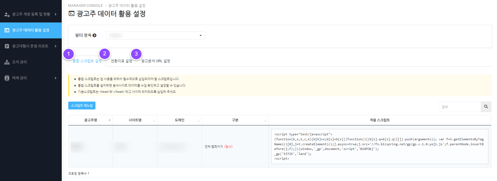
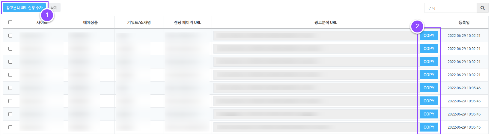
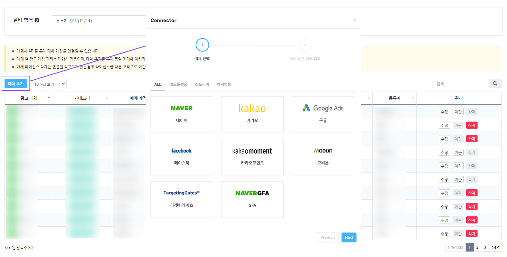
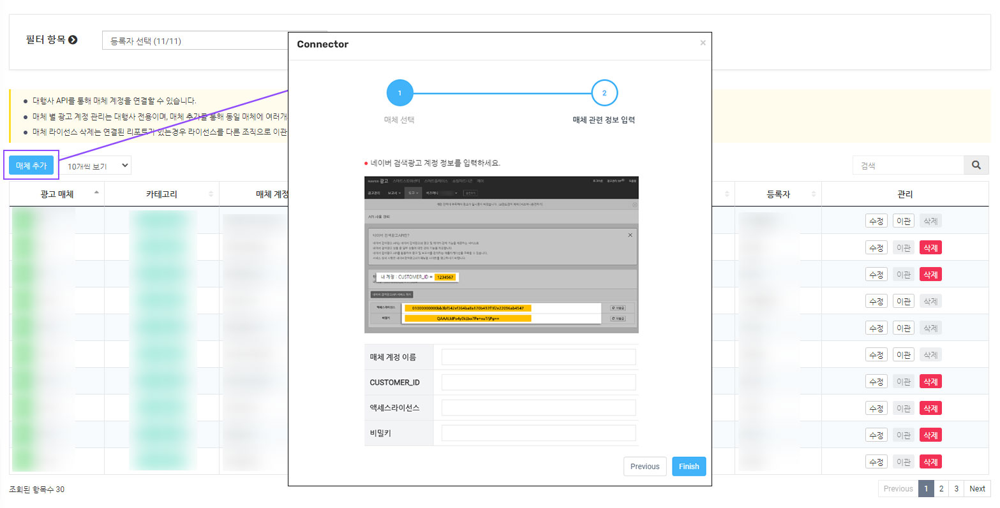
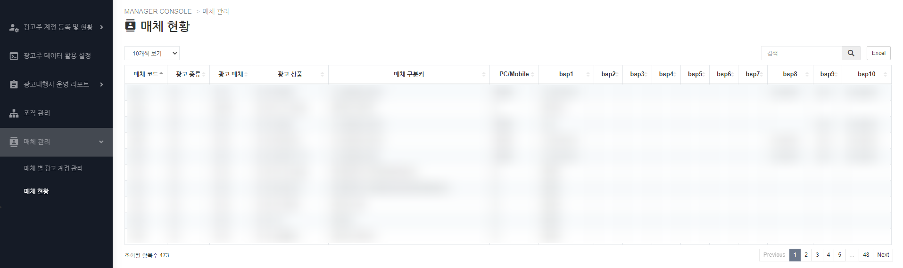

# MANAGER CONSOLE


MANAGER CONSOLE은 IN-TP 사용을 위한 조직과 광고주를 설정하고 관리할 수 있습니다.


## 1. 메뉴 구성

| 메뉴             | 설명                     |
| -------------- | ---------------------- |
| 광고주 계정 등록 및 현황 | 광고주의 계정 등록/설정과 현황      |
| 광고주 데이터 활용 설정  | 광고주의 데이터 수집과 분석위한 설    |
| 광고대행사 운영 리포트   | 조직 실적 매체 실적 현          |
| 조직 관리          | 직원 등록 및 관리             |
| 매체 관리          | CTS 앱 사용을 위한 매체 연결과 관리 |

## 2. 광고주 계정 등록 및 현황

### 2-1. 광고주 계정 등록 및 현황


광고주 계정 등록 및 등록된 광고주의 현황을 한눈에 볼 수 있습니다.


<figure><figcaption>
광고주 계정 등록 및 현황 화
</figcaption></figure>

#### 1. 필터 및 조직 선택&#x20;

* **필터 항목 :** 사용 상태(사용중/사용중지)를 선택하여 선택에 맞는 **** 광고주 목록을 확인할 수 있습니다.
* **조직 선택 :** 팀을 클릭하면 팀이 관리하는 광고주를 확인할 수 있습니다.

**2. 광고주 등록**

IN-TP를 사용할 광고주를 등록합니다.

광고주 목록 상단에 광고주 등록 버튼을 클릭하면 모달창이 노출됩니다.

<figure><figcaption>
광고주 등록 화면 
</figcaption></figure>

* **광고주 등록 선택 :** 광고주 신규 등록과 기존 등록된 광고주 중 등록할 광고주 타입을 선택합니다.
* **광고주명 :** 등록할 광고주명을 입력합니다.
* **도메인명 / 도메인 :** 분석할 사이트의 도메인명과 도메인을 입력합니다.
* **부계정 아이디/비밀번호 :** 부계정은 광고주에게 전달할 계정입니다. [undefined-1.md](../in-tp-1/undefined-1.md "mention") <mark style="color:blue;">**참고**</mark>
* 부계정 ID를 복수로 등록할 경우 + 버튼을 클릭하여 입력창을 추가로 생성합니다.
* 부계정 비밀번호는 4\~6자리, 최소 1개의 숫자 혹은 특수문자가 포함되어야 합니다.
* x 버튼을 클릭하면 입력한 부계정 ID가 삭제됩니다. &#x20;
* **광고주 이동 :** 광고주를 관리할 조직을 선택하여 이동 수 있습니다.
* 기존 등록된 광고주에서 도메인 추가 및 부계정을 생성하고자 하는 경우 \[기존 등록된 광고주] 타입 선택 > 광고주 선택 후 도메인 및 부계정을 추가 생성할 수 있습니다.

**3. 광고주 목록**

광고주 등록을 통해 입력된 정보가 목록에 노출되며 등록된 광고주의 사용 상태 확인 및 매체 연결 관리할 수 있습니다.

* **광고주 정보 수정 :** 광고주의 정보를 확인하고 수정할 수 있습니다.&#x20;
* **사용 상태 :** 광고주의 사용 상태를 설정할 수 있습니다.
* **광고 계정 관리 :** 광고주와 연결할 광고 매체 계정을 관리(추가/수정/연결/해제)하고 상태를 확인할 수 있습니다. [#3-1.](manager-console.md#3-1. "mention")<mark style="color:blue;">**참고**</mark>&#x20;
* **앱 바로가기 :** 각각의 앱 버튼 클릭 시 해당 광고주의 앱으로 이동합니다.

#### 3-1. 광고 계정 관리&#x20;

<figure><figcaption>
광고 계정 관리 모달 화면
</figcaption></figure>

광고주와 연결할 광고 매체 계정을 관리(추가/수정/연결/해제)하고 상태를 확인할 수 있습니다.

* **매체 계정 추가 :** 등록할 매체 정보를 입력하여 IN-TP와 연결을 진행합니다.
* **매체 계정 수정 :** 수정할 매체 계정을 선택하여 정보를 수정할 수 있습니다.
* **광고주 계정 연결 :** 매체 계정과 광고주 계정을 선택하여 광고주 계정 연결을 진행합니다.&#x20;

**4. 광고주 일괄 이동**&#x20;

<figure><figcaption>
광고주 이동 화면
</figcaption></figure>

광고주 목록에서 이동할 광고주들을 선택하고 다른 조직으로 이동할 수 있습니다. \
단, MANAGER CONSOLE > 조직 관리 메뉴에서 같은 레벨 또는 상위 조직으로는 이동이 불가하며, \
**같은 레벨 또는 상위 조직으로 이동을 원할 경우 상위 조직에 있는 담당자에게 요청**하여 주세요.

1. 선택한 광고주 목록을 확인할 수 있습니다. \
   x 버튼을 클릭하면 광고주를 제외할 수 있습니다.
2. 이동할 조직을 선택한 후 \[저장] 버튼을 클릭하면 광고주 이동이 완료됩니다.

### 2-2. 광고주 현황


관리중인 광고주의 IN-TP 운영 현황과 MANAGER CONSOLE > 광고주 계정 등록 및 현황에서 연결한 네이버/카카오/구글 매체 계정의 광고비 소진 현황과 광고비 잔액을 확인할 수 있습니다.


<figure><figcaption>
광고주 현황 화면
</figcaption></figure>

#### 1. 필터 항목&#x20;

**필터 :** 조직을 선택하여 해당 조직이 관리하는 광고주 목록을 조회할 수 있습니다.&#x20;

#### 2. 광고주 현황 목록&#x20;

* **운영 현황 :** 광고주가 사용중인 앱의 데이터를 체크하여 운영 현황을 확인할 수 있습니다.
* **알람 :** \[CTS > 알람 설정]에서 설정한 기준에 따른 알람을 개수를 표기합니다.  \
  \[바로가기]를 클릭하면 \[알람 설정] 페이지로 이동합니다.
* **계정상태 :** 매체 계정의 운영 상태를 확인할 수 있습니다.
* **당월 광고비 소진현황** : 1일부터 전일까지의 광고비 소진 현황을 확인할 수 있습니다.
* **당일 광고비 소진현황 :** 실시간으로 현재 시점 당일 광고비 소진현황을 확인할 수 있습니다.
* **광고비 잔액 :** 실시간으로 현재 시점 광고비 잔액을 확인할 수 있습니다.
* **VAT 제외 / VAT 포함 :** 광고주 현황 목록 상단 VAT 옵션 기능을 설정하여 광고비 소진 현황과 광고비 잔액을 VAT 제외 또 VAT 포함된 금액으로 확인할 수 있습니다.


광고비 소진 현황과 잔액은 매체별 API 제공 형태가 다르기에 시점이 상이할 수 있습니다.


## 3. 광고주 데이터 활용 설정

<figure><figcaption>
광고주 데이터 활용 설정 화면
</figcaption></figure>

#### 1. 필터 항목

스크립트를 설정 광고주를 선택합니다.

#### 2-1. 통합 스크립트 설정

통합 스크립트는 앱 사용을 위해서 분석할 사이트에 필수적으로 삽입되어야 합니다.


* 통합 스크립트를 설치하면 분석사이트 데이터를 수집/확인하고 설정할 수 있습니다.
* 기본스크립트는 \<head>와 \</head> 태그 사이에 위치되도록 삽입해 주세요.&#x20;


<figure><figcaption>
통합 스크립트 설정
</figcaption></figure>

1. 스크립트 매뉴얼을 클릭하면 스크립트 설치에 대한 상세 내용을 확인할 수 있습니다.
2. 적용 스크립트 박스를 클릭하면 자동으로 내용이 복사됩니다.

#### 2-2. 전환지표 설정&#x20;

사용자정의 전환 지표를 설정하여 확인할 수 있습니다.


* 사용자정의 전환지표는 최대 10개까지 사용가능하며, 사용할 전환지표를 활성화시키면 \[CTS > 기여분석] 리포트에 추가되어 확인할 수 있습니다.
* 사용자정의 전환지표 사용을 비활성화 하더라도 데이터는 정상적으로 수집되며, 활성화로 변경시 리포트에 보여집니다.


<figure><figcaption>
전환지표 설정
</figcaption></figure>

#### 2-3. 광고분석 URL

광고 분석에 필요한 광고 추적 URL을 생성하는 설정 화면입니다.&#x20;

<figure><figcaption>
광고분석 URL
</figcaption></figure>

1. 광고분석 URL 설정 추가 버튼을 클릭하면 개별 설정과 일괄 설정이 가능합니다.
2. 광고분석 URL을 클릭하면 복사가 가능합니다.

## 4. 광고대행사 운영 리포트

### 4-1. 조직 실적


각 조직이 관리하는 광고주의 성과를 확인할 수 있습니다.


<figure><figcaption>
조직 실적 화면
</figcaption></figure>

#### 1. 필터 및 옵션 선택

* 기간 : 조회 기간을 선택해 주세요.
* 조직 선택 : 조직을 선택해 주세요.

**2. 기간별 성과 추이**&#x20;

\[조직 / 광고주 / 광고매체] 성과 추이를 기간별로 확인할 수 있습니다.

**3. 조직 실적 목록**

<figure><figcaption>
조직 실적 목록 화면
</figcaption></figure>

각 조직의 매출액을 확인할 수 있습니다.

* \+ 버튼을 클릭하면 해당 조직이 관리하는 광고주의 광고매체별 상세 매출액을 확인할 수 있습니다.

### 4-2. 매체 실적&#x20;


각 광고매체별 실적을 확인할 수 있습니다.


<figure><figcaption></figcaption></figure>

#### 1. 필터 항

* 기간 : 조회 기간을 선택해 주세요.

**2. 기간별 성과 추이**&#x20;

\[광고형태 / 광고매체] 성과 추이를 기간별로 확인할 수 있습니다.

**3. 매체 실적 목**

<figure><figcaption>
매체 실적 목 화면 
</figcaption></figure>

각 광고형태의 매출액을 보여줍니다.&#x20;

* \+ 버튼을 클릭하면 해당 광고 형태의 광고매체별 상세 매출액을 확인할 수 있습니다.

## 5. 조직 관리

<figure><figcaption>
조직 관리 화면 
</figcaption></figure>

#### 1. 필터 및 옵션 선택

전체 직원의 권한 및 사용상태를 선택하여 조회할 수 있습니다.

#### 2. 권한

전체 직원의 각 권한에 해당하는 인원수를 확인할  있습니다. &#x20;

#### 3. 조직 추가/수정/삭제&#x20;

<figure><figcaption>
조직 추가 화면 
</figcaption></figure>


폴더의 아이콘을 클릭하면 하위 폴더를 볼 수 있습니다. 폴더명을 클릭하면 해당 폴더의 정보가 우측 표에 활성화됩니다.


* **추가 :** 추가하려는 조직의 상위 폴더를 선택 후 버튼이 활성화가 되면, \[조직 추가] 버튼을 눌러 하위에 새 조직을 생성합니다.&#x20;
* **수정 :** 수정하려 조직을 선택 후 버튼이 활성화가 되면 \[수정] 버튼을 클릭합니다.&#x20;
* **삭제 :** 삭제하려 조직을 선택 후 활성화가 되면 \[삭제] 버튼을 클릭합니다. \
  조직 내에 직원이 있을 경우 삭제할 수 없습니다. 직원을 다른 조직으로 이동한 후 삭제해주세요. \
  조직 삭제 시 폴더는 영구적으로 삭제됩니다.

#### 4. 직원 등록&#x20;

<figure><figcaption>
직원 등록 화면
</figcaption></figure>


(\*) 표시는 필수로 입력해야합니다.


* 조직 : 조직 추가에서 생성한 조직을 선택합니다.
* 권한 설정 : 직원에게 권한을 부여합니다.

> **운영자** : 편집/관리 권한 + **'조직' 관리**
>
> **관리자** :  관리 권한 + **'직원' 까지만 관리**
>
> **뷰어** : 보기 권한

* 앱 접근 권한 : 해당 직원의 접근 가능한 앱을 설정할 수 있습니다. 매니저콘솔 앱은 필수로 설정되어 있으며 변경이 불가합니다.

#### 5. 직원 목록&#x20;

<figure><figcaption>
직원 목록 화면
</figcaption></figure>

* 권한 : 직원등록에서 설정한 권한을 확인할 수 있습니다.
* 사용상태 : 사용상태 여부를 설정할 수 있습니다. 사용중지로 설정하면 해당 직원은 IN-TP에 접속할 수 없습니다.
* 관리 : \[수정]을 통하여 직원 정보를 수정할 수 있습니다.

## 6. 매체 관리 &#x20;

### 6-1. 매체 별 광고 계정 관리&#x20;


* CTS 앱에서 확인할 매체를 추가합니다.
* 매체 추가를 통해 동일 매체에 여러 개의 계정을 연결할 수 있습니다.


<figure><figcaption>
매체 별 광고 계정 관리 화면
</figcaption></figure>

#### 1. 필터 항목 &#x20;

등록자를 선택하면 해당 등록자가 추가한 매체 정보를 목록으로 확인할 수 있습니다.

#### 2. 매체 추가

\[매체 추가] 버튼 클릭 시 매체를 선택하고 등록할 수 있는 Connector 모달 창이 노출됩니다.

#### 2-1. 매체 선택&#x20;

<figure><figcaption>
매체 선택 화면 
</figcaption></figure>

연결할 매체를 선택 후 다음 단계로 이동합니다.

#### 2-2. 매체 관련 정보 입력&#x20;

<figure><figcaption>
매체 관련 정보 입력 화면
</figcaption></figure>

매체 계정 정보를 입력하여 각 매체에 연결할 수 있습니다.\
입력할 정보는 매체 별로 상이하며 카카오/구글/페이스북은 OAuth로 연결할 수 있습니다.\

**3. 광고 매체 목록**

<figure><figcaption></figcaption></figure>

* **광고 매체 :** 등록한 광고 매체를 나타냅니다.&#x20;
* **카테고리 :** 해당 매체의 카테고리를 나타냅니다.&#x20;
* **매체 계정 이름 :** 매체 추가 단계에서 입력한 매체 계정 이름을 나타냅니다. 입력이 없을 경우 등록자의 계정 정보(IN-TP 로그인 아이디)가 노출됩니다.
* **연결 상태 :** 매체 연결 상태의 여부를 나타냅니다.
* **연결된 리포트 유무 :** \[MANAGER CONSOLE 광고주 계정 등록 및 현황]에서 광고주와 연결된 리포트 유무를 나타냅니다.
* **등록자 :** 광고 매체를 등록자를 나타냅니다.

#### 3-1. 관리

* 재연결 : 연결이 없을 경우 재연결을 시도할 수 있습니다. 재연결은 같은 아이디로만 가능합니다.
* 수정 : 등록 매체의 내용을 수정할 수 있습니다.&#x20;
* 삭제 : 등록 매체를 삭제합니다.
* 이관 : 등록 매체의 라이선스를 이관합니다.

#### 3-1-1. 라이선스 이관

<figure><figcaption>
라이선스 이관
</figcaption></figure>

* 매체 라이선스를 이관할 직원을 선택한 후 이관할 수 있습니다.
* 매체 라이선스 이관은 조직 관리에서 팀에 소속된 직원에게만 이관이 가능하며, 다른 팀의 직원에게 이관을 하고자 하는 경우 조직 관리에서 팀 전체를 관리할 수 있는 상위 관리자에게 요청해 주세요.
* 단, 해당 매체에서 이관하고자 하는 직원이 관리할 수 있도록 권한이 부여되어 있어야 합니다.

### 6-2. 매체 현황&#x20;


IN-TP에서 확인할 수 있는 전체 매체의 정보입니다.


<figure><figcaption></figcaption></figure>

* **매체 코드 :** 매체 고유 코드 번호를 표기합니다.&#x20;
* **광고 종류 :** 키워드/소재  광고 종류를 표기합니다.&#x20;
* **광고 매체 :** 광고 매체 종류를 표기합니다.&#x20;
* **광고 상품 :** 광고 상품 종류를 표기합니다.&#x20;
* **매체 구분 키 :** 매체구분키로 어떤 광고인지 분류할 수 있습니다.
* **PC/Mobile :** 매체 유입 디바이스의 종류를 표기합니다.&#x20;
* **bsp :** 예약 필드명으로 앞의 매체 구분키에서 분류된 항목을 가져옵니다. \
  ex) 검색광고일 경우 bsp1=키워드id,, bsp8=키워드 ...

분석 표를 엑셀 문서로 다운로드 할 수 있습니다.

