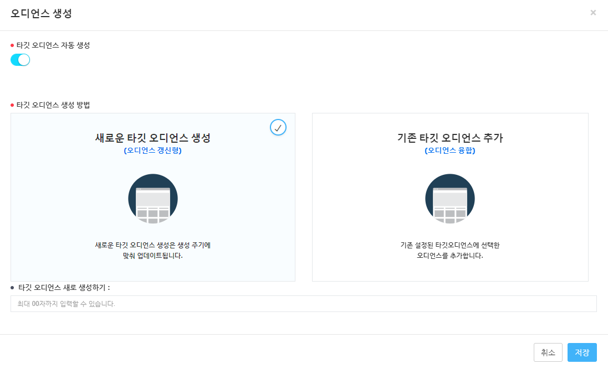
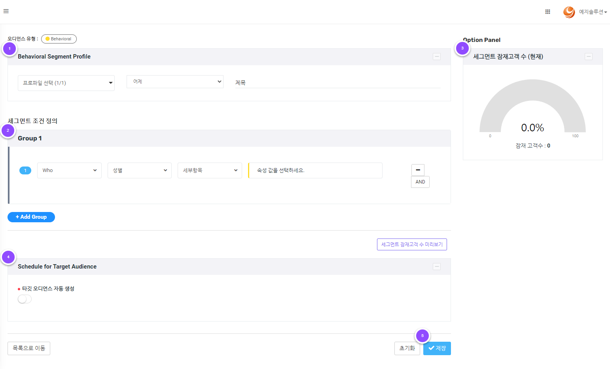
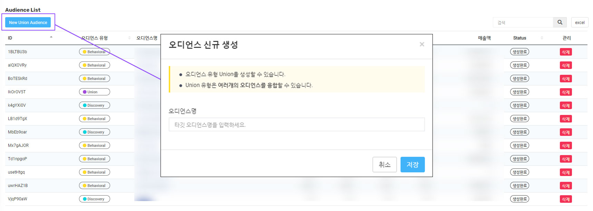
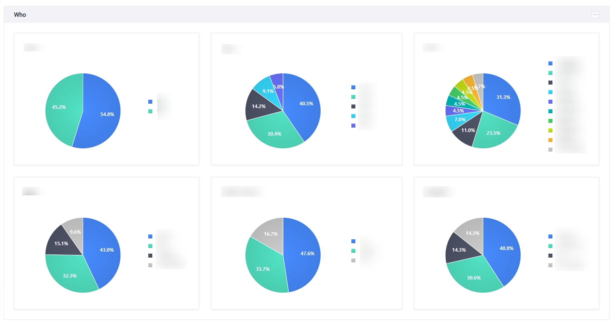

# TAM

## 1. 메뉴 구성&#x20;

| 메뉴              | 설명                            |
| --------------- | ----------------------------- |
| Segment Build   | 행동기반 세그먼트 생성 및 관리             |
| Target Audience | 매일 업데이트되는 타깃 오디언스의 상세 데이터 분석  |

## 2. Segment Build

> * 새로운 세그먼트 릿을 생성할 수 있습니다.
> * 생성된 세그먼트의 속성 및 추세 데이를 확인할 수 있습니다.
> * 해당 세그먼트를 이용하여 생성된 오디언스의 목록과 상세 페이지를 조회할 수 있습니다.

### 2-1. Behavioral


잠재고객군을 정의하고, 정의된 잠재 고객군을 관리/분석/추출할 수 있습니다.


<figure><figcaption>
Behavioral 화면
</figcaption></figure>

#### 1. 필터 항목

조회 기간을 선택해 주세요.

#### 2. Pinned

고정된 세그먼트의 속성 및 추세 데이터를 시각화하여 확인할 수 있습니다.&#x20;

| 속성명       | 설명                         |
| --------- | -------------------------- |
| 잠재고객수     | 생성 조건에 맞게 선별된 고객의 수 (세그먼트) |
| 방문수       | 잠재고객의 총 방문 횟수              |
| 총 체류시간 합계 | 잠재고객의 페이지 총 체류시간의 합계       |
| 전환수       | 잠재고객의 총 전환수                |
| 매출액       | 잠재고객의 총 매출액                |

**3. 세그먼트 목록**&#x20;

* **고정 :** 화면 상단 Pinned에 고정할 세그먼트를 선택합니다.
* **세그먼트 유형 :** 생성한 세그먼트의 유형을 확인할 수 있습니다.
* **세그먼트 명 :** 해당 세그먼트를 이용하여 생성된 오디언스의 목록과 상세 페이지를 조회할 수 있습니다.
*   **오디언스 생성여부 > 오디언스 관리**&#x20;

    <figure><figcaption>
세그먼트 목록 > 오디언스 생성여부 > 오디언스 관리
</figcaption></figure>

> **오디언스 자동 생성 여부 :** 오디언스의 자동 생성 여부를 설정합니다.
>
> **새로운 타깃 오디언스 생성 :** 생성 주기에 맞춰 오디언스를 업데이트합니다.
>
> **기존 타깃 오디언스 생성 :** 기존 생성되어 있는 오디언스를 선택하여 해당 오디언스 융합합니다.

* **관리**

> **스냅샷 :** 스냅샷 생성 버튼을 클릭한 당일의 오디언스를 생성합니다.
>
> **조건복사 :** 해당 세그먼트 속성을 유지한 세그먼트 생성 페이지로 이동합니다.
>
> **삭제 :** 세그먼트를 삭제합니다.

**4. Behavioral 세그먼트 신규 생성**&#x20;

\[New Behavioral User Segment] 버튼 클릭 시 새로운 세그먼트를 작성할 수 있는 [5. 세그먼트 생성](tam.md#5.) 페이지로 이동합니다.

#### 5. 세그먼트 생성&#x20;

> 새로운 세그먼트 작성을 위해 프로파일 및 제목 선정, 세그먼트 조건 정의, 타깃 오디언스 자동 생성 여부 체크 후 저장 시, 해당 세그먼트의 정보가 저장됩니다.

<figure><figcaption>
세그먼트 생성 화
</figcaption></figure>

**5-1. 프로파일 설정**

* 적용 프로파일 선택
* 세그먼트 제목 입력
*   날짜 범위 지정

    **최근 기간 :** 접속일을 기준으로 최근 n일간

**5-2. 세그먼트 조건 정의**

세그먼트 조건 정의 단계에서 한 그룹 안에 여러 개의 조건을 걸 수 있으며(AND 조건), 별도의 그룹을 생성하여 합집합(OR)으로 다른 조건에 대한 잠재고객도 같이 선별이 가능합니다.

* **\[AND] :** 동일 그룹내 조건이 공통으로 포함하는 <mark style="color:blue;">**교집합**</mark> <mark style="color:purple;"></mark>&#x20;
* **\[OR] :** 그룹 별 하나에라도 속하는 조건을 모두 모은 <mark style="color:blue;">**합집합**</mark>
* **\[숫자입력형] :** 숫자를 입력하여 조건을 선별합니다. \[+ add] 를 클릭하면 또 하나의 Depth가 생성되어 숫자 범위를 지정할 수 있습니다.
* **\[복수선택형] :** 선택 항목 중 선 조건을 복수 선택하여 선별합니다.

**5-3. 잠재고객 수 미리보기**

잠재고객 수 미리보기 버튼을 클릭하면 **5-2. 세그먼트 조건 정의**를 마친 선별 그룹의 잠재고객 수를 미리 알 수 있습니다.

**5-4. 타겟 오디언스 생성**&#x20;

<figure><figcaption>
타겟 오디언스 생성
</figcaption></figure>

* **오디언스 자동 생성 여부 :** 오디언스의 자동 생성 여부를 설정합니다.
* **새로운 타깃 오디언스 생성 :** 생성 주기에 맞춰 오디언스를 업데이트합니다.
* **기존 타깃 오디언스 생성 :** 기존 생성되어 있는 오디언스를 선택하여 해당 오디언스 융합합니다.

#### 5-6. 저장

\[저장] 버튼을 클릭하면 세그먼트의 등록 정보가 저장되며 목록에서 저장된 내용을 확인할 수 있습니다.


타깃 오디언스 자동 생성 비활성화 시 타깃 오디언스 목록에는 생성되지 않습니다.


### 2-2. Discovery


머신러닝을 이용하여 세그먼트를 자동 정의 및 생성할 수 있습니다.


<figure><figcaption>
디스커버리 화면
</figcaption></figure>

#### 1. 필터 항목

조회 기간을 선택해 주세요.

#### 2. Pinned&#x20;

고정된 세그먼트의 속성 및 추세 데이터를 시각화하여 확인할 수 있습니다.&#x20;

| 속성명       | 설명                         |
| --------- | -------------------------- |
| 잠재고객 수    | 생성 조건에 맞게 선별된 고객의 수 (세그먼트) |
| 방문수       | 잠재고객의 총 방문 횟수              |
| 총 체류시간 합계 | 잠재고객의 페이지 총 체류시간의 합계       |
| 전환수       | 잠재고객의 총 전환수                |
| 매출액       | 잠재고객의 총 매출액                |

#### 3. 디스커버리 목록 &#x20;

* **고정 :** 화면 상단 Pinned에 고정할 세그먼트를 선택합니다.
* **세그먼트 유형 :** 생성한 세그먼트의 유형을 확인할 수 있습니다.
* **세그먼트 명 :** 해당 세그먼트를 이용하여 생성된 오디언스의 목록과 상세 페이지를 조회할 수 있습니다.
*   **오디언스 생성여부 > 오디언스 관리**&#x20;

    <figure><figcaption>
세그먼트 목록 > 오디언스 생성여부 > 오디언스 관리
</figcaption></figure>

> **오디언스 자동 생성 여부 :** 오디언스의 자동 생성 여부를 설정합니다.
>
> **새로운 타깃 오디언스 생성 :** 생성 주기에 맞춰 오디언스를 업데이트합니다.
>
> **기존 타깃 오디언스 생성 :** 기존 생성되어 있는 오디언스를 선택하여 해당 오디언스 융합합니다.

* **관리**&#x20;

> **스냅샷 :** 스냅샷 생성 버튼을 클릭한 당일의 오디언스를 생성합니다.
>
> **조건복사 :** 해당 세그먼트 속성을 유지한 그먼트 생성 페이지로 이동합니다.
>
> **삭제 :** 세그먼트를 삭제합니다.

#### 4. 디스커버리 세그먼트 신규 생성&#x20;

\[New Discovery Segment] 버튼 클릭 시 새로운 디스커버리를 작성할 수 있는 [5. 디스커버리 생성](tam.md#5.-1) 페이지로 이동합니다.

#### 5. 디스커버리 생성&#x20;

새로운 Discovery 세그먼트 생성 시, Clustering과 RFM 세그먼트 중 원하는 종류를 선택할 수 있습니다.


디스커버리 유형 선택하면 군집별 상세 데이터를 확인할 수 있습니다.


<figure><figcaption>
 디스커버리 선택
</figcaption></figure>

#### **5-1. 클러스터링(Clustering)**

> 유사한 속성을 갖는 잠재고객을 자동 그룹핑합니다.&#x20;

<figure><figcaption>
클러스터링 화면
</figcaption></figure>

클러스터링 세그먼트 생성 시 머신 러닝으로 분류된 군집을 선택하여 저장할 수 있습니다.

#### 5-1-1. 클러스터링 세그먼트 프로파일&#x20;

등록된 프로파일을 선택 후 클러스터링 세그먼트 명을 입력합니다.

#### 5-1-2. 군집 선택&#x20;

머신러닝으로 만들어진 군집 목록 선택이 가능합니다.

#### 5-1-3. 데이터 상세&#x20;

해당 군집의 디바이스/최종 유입(광고) 매체/주문 그룹/매출 그룹 상세 데이터를 확인할 수 있습니다.

#### 5-1-4. 타겟 오디언스 생성&#x20;

<figure><figcaption>
오디언스 생성
</figcaption></figure>

* **오디언스 자동 생성 여부 :** 오디언스의 자동 생성 여부를 설정합니다.
* **새로운 타깃 오디언스 생성 :** 생성 주기에 맞춰 오디언스를 업데이트합니다.
* **기존 타깃 오디언스 생성 :** 기존 생성되어 있는 오디언스를 선택하여 해당 오디언스 융합합니다.

#### **5-2. RFM**

> 최근성(Recency), 빈도(Frequency) 데이터를 활용하여 잠재고객을 자동 그룹핑합니다.&#x20;

<figure><figcaption>
RFM 세그먼트 생성 화면
</figcaption></figure>

#### 5-2-1. RFM 세그먼트 프로파일&#x20;

등록된 프로파일을 선택 후 RFM 세그먼트 명을 입력합니다.

#### 5-2-2. RFM

RFM 세그먼트 생성 시 Recency(최근), Frequency(빈도) 별로 분류된 8개의 그룹을 선택할 수 있습니다.&#x20;

#### 5-2-3. RFM 세그먼트 목록&#x20;

그룹 목록에 그룹명과 해당 그룹의 속성 및 특성 통계를 제공함으로써 고객이 원하는 세그먼트를 간편하게 선택하실 수 있습니다.

#### 5-2-4. 타겟 오디언스 생성&#x20;

<figure><figcaption>
오디언스 생성
</figcaption></figure>

* **오디언스 자동 생성 여부 :** 오디언스의 자동 생성 여부를 설정합니다.
* **새로운 타깃 오디언스 생성 :** 생성 주기에 맞춰 오디언스를 업데이트합니다.
* **기존 타깃 오디언스 생성 :** 기존 생성되어 있는 오디언스를 선택하여 해당 오디언스 융합합니다.

#### 6. 저장&#x20;

\[저장] 버튼을 클릭하면 세그먼트의 등록 정보가 저장되며 목록에서 저장된 내용을 확인할 수 있습니다.


타깃 오디언스 자동 생성 비활성화 시 타깃 오디언스 목록에는 생성되지 않습니다.


## 3. Target Audience

Segment Build에서 설정한 오디언스가 설정 주기에 맞춰 업데이트되며, 속성 및 특성 통계를 확할 수 있습니다. &#x20;

### 3-1. Audience


세그먼트에 생성된 오디언스 목록을 확인 및 관리할 수 있습니다.


<figure><figcaption>
오디언스 목록 화면
</figcaption></figure>

#### 1. 오디언스 신규 생성&#x20;

<figure><figcaption></figcaption></figure>

새로운 융합 오디언스를 생성합니다. 오디언스 명을 입력 후 저장 버튼을 누르면 생성이 완료됩니다. \
복수의 세그먼트를 융합할 수 있습니다.

#### 2. 오디언스 목록  &#x20;

생성된 오디언스 목록의 데이터를 확인할 수 있습니다.&#x20;

* **오디언스 유형 :** Unite, Behavioral, Discovery, Snapshot 유형을 표기합니다.
* **오디언스 명 :** 생성된 오디언스의 상세 페이지를 조회할 수 있습니다.
* **유저수/MAU/DAU/전환수/매출액 :** 생성된 오디언스 별 상세 데이터를 확할 수 있습니다. &#x20;
* **Status :** 오디언스 생 상태를 나타냅니다.
* **관리 :** 생성한 오디언스를 삭제할 수 있습니다.

#### 3. 엑셀 다운로드

생성된 오디언스 목록을 엑셀 파일로 다운로드 할 수 있습니다.&#x20;

### 3-2. Audience Detail


오디언스의 상세 지표를 차트 및 그래프로 확인 할 수 있습니다.


<figure><figcaption>
오디언스 디테일
</figcaption></figure>

#### 1. 오디언스 프로파일&#x20;

**고유 태그 :** 해당 오디언스의 고유 태그를 나타냅니다.

**오디언스 이름 :** 오디언스 이름을 입력하고 수정 및 저장이 가능합니다.

#### **2. 오디언스 프로파일 요약**

해당 오디언스에 융합된 세그먼트의 상세 프로파일을 표기합니다.&#x20;

#### 3. 오디언스 멤버스

생성된 세그먼트에 해당하는 잠재고객의 목록을 확인 및 관리합니다. 엑셀 다운로드를 통해 잠재고객 목록을 문서로 확인할 수 있습니다.

<figure><figcaption>
오디언스 멤버스 화면
</figcaption></figure>


표에서 1,000명에 대한 상세 데이터를 확인할 수 있습니다.


#### 4. 오디언스 구성 상세

#### 4-1. Who

항목 오디언스 비율 파악할 수 있습니다.

> 성별, 연령, 지역, 디바이스 유형, 운영체계

<figure><figcaption>
Who
</figcaption></figure>

#### 4-2. Did

항목 오디언스 비율 파악할 수 있습니다.&#x20;

> 첫 유입 유형, 마지막 유입 유형, 광고 유입 매체/상품

<figure><figcaption>
Did
</figcaption></figure>

#### 4-3. Want

유입 및 상품 비중을 파악할 수 있습니다.&#x20;

> 내부 검색어, 유입 검색어, 주문 상품명, 장바구니 상품명, 조회 상품명

<figure><figcaption>
Want
</figcaption></figure>

**4-4. Value**

지난 30일간 누적 주문 금액과 평균 주문 금액을 확할 수 있습니다.&#x20;

<figure><figcaption>
Value
</figcaption></figure>
